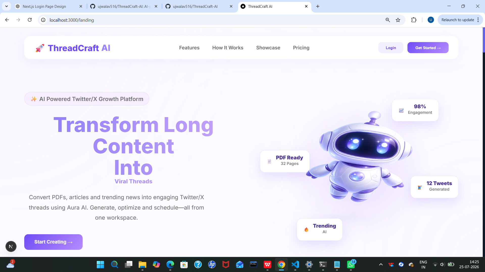
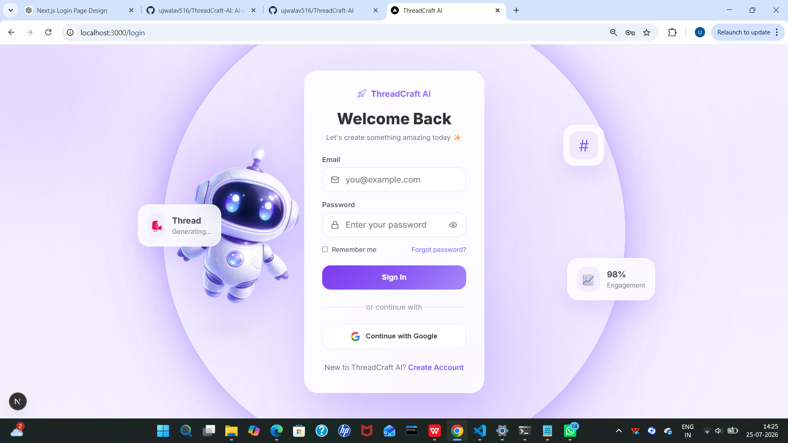
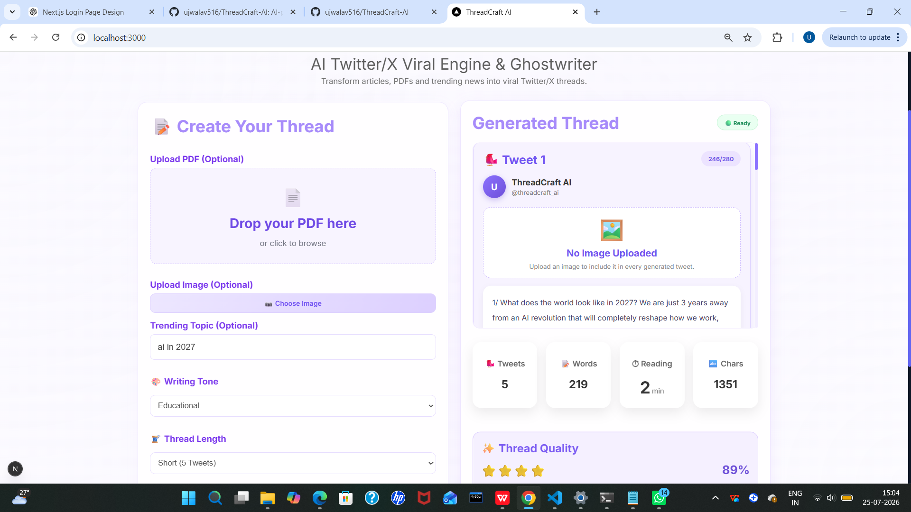
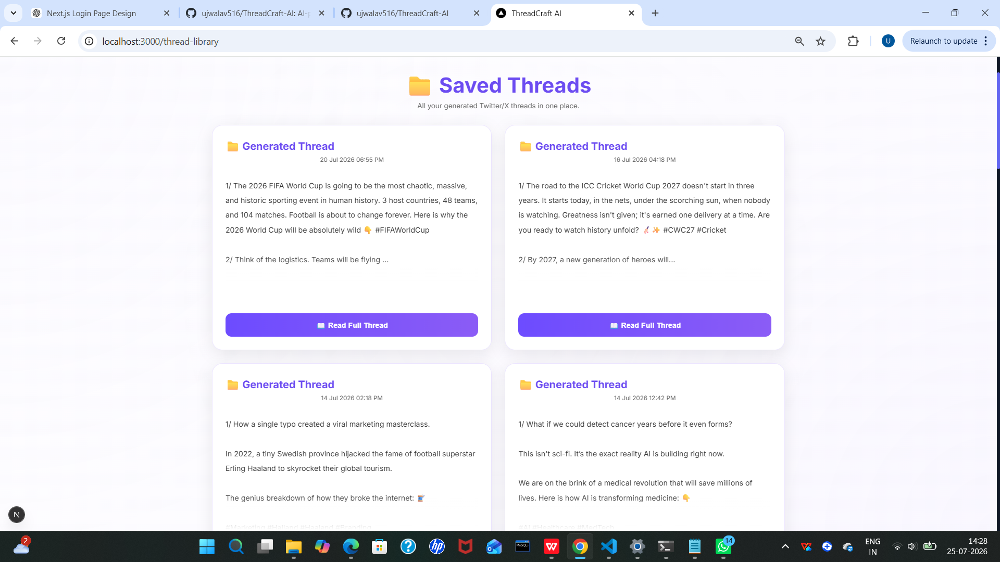
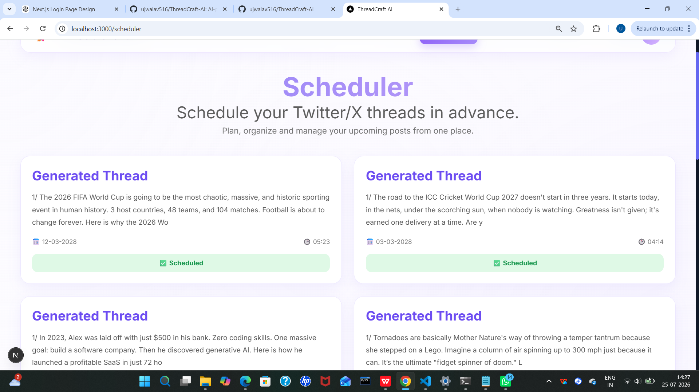
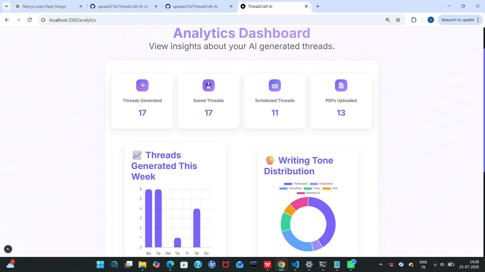

# 🚀 ThreadCraft AI


> **AI-Powered Twitter/X Thread Generation Platform using Google Gemini AI**

ThreadCraft AI is a modern AI-powered platform that helps users generate engaging Twitter/X threads from PDFs, articles, or custom topics. It combines Google Gemini AI with a FastAPI backend and a modern Next.js frontend to simplify content creation, scheduling, analytics, and publishing.

---


## 💡 Why ThreadCraft AI?

Creating engaging Twitter/X threads manually takes time and effort. ThreadCraft AI streamlines the entire process by using Google Gemini AI to transform PDFs, articles, and custom topics into well-structured, engaging threads. It also provides scheduling, analytics, and publishing capabilities in one platform, making content creation faster and more efficient.

---


## ✨ Features

- 🤖 AI-powered Thread Generation
- 📄 PDF Upload & Thread Creation
- 📝 Topic-based Thread Generation
- 📚 Thread Library
- 📅 Thread Scheduler
- 📊 Analytics Dashboard
- 🐦 Publish directly to Twitter/X
- 🔐 User Authentication
- 🎨 Modern Responsive UI
- ⚡ FastAPI Backend
- ⚛️ Next.js Frontend

---


## 🛠️ Tech Stack

### Frontend
- Next.js
- React
- JavaScript
- CSS

### Backend
- FastAPI
- Python

### AI
- Google Gemini AI

### APIs
- Twitter/X API

### Development Tools
- VS Code
- Git
- GitHub

---

# 📸 Project Screenshots

## 🏠 Landing Page



## 🔐 Login Page



## 📊 Dashboard



## 📚 Thread Library



## 📅 Scheduler



## 📈 Analytics Dashboard




---

# 🏗️ System Architecture

```text
                    User
                      │
                      ▼
            Next.js Frontend (UI)
                      │
                REST API Requests
                      │
                      ▼
             FastAPI Backend (Python)
                      │
      ┌───────────────┼────────────────┐
      │               │                │
      ▼               ▼                ▼
 Google Gemini AI   Thread Storage   Scheduler
      │               │                │
      └───────────────┼────────────────┘
                      │
                      ▼
            Analytics Dashboard
                      │
                      ▼
             Publish to Twitter/X
```

ThreadCraft AI follows a client-server architecture where the Next.js frontend communicates with a FastAPI backend through REST APIs. The backend integrates Google Gemini AI for intelligent thread generation while managing scheduling, analytics, and thread storage.


---

# ⚙️ Installation & Setup

## 1️⃣ Clone the Repository

```bash
git clone https://github.com/ujwalav516/ThreadCraft-AI.git
cd ThreadCraft-AI
```

---

## 2️⃣ Backend Setup

Create a virtual environment:

```bash
python -m venv venv
```

Activate it:

**Windows**

```bash
venv\Scripts\activate
```

Install dependencies:

```bash
pip install -r requirements.txt
```

Create a `.env` file in the project root and add your API keys.

Start the backend:

```bash
uvicorn main:app --reload
```

---

## 3️⃣ Frontend Setup

Navigate to the frontend folder:

```bash
cd frontend(1)
```

Install dependencies:

```bash
npm install
```

Start the development server:

```bash
npm run dev
```

The frontend will be available at:

```
http://localhost:3000
```

The backend runs at:

```
http://127.0.0.1:8000
```

---


# 📂 Project Structure

```
ThreadCraft-AI/
│
├── frontend(1)/          # Next.js frontend
│   ├── src/
│   ├── public/
│   └── package.json
│
├── static/               # Static assets
├── templates/            # HTML templates
├── scheduled_posts/      # Scheduled thread data
├── saved_threads(1)/     # Saved generated threads
├── pdf_uploads/          # Uploaded PDF files
│
├── main.py              # FastAPI backend
├── requirements.txt     # Python dependencies
├── .env                 # Environment variables (not committed)
└── README.md
```

---

# 🚀 How It Works

1. User uploads a PDF or enters a custom topic.
2. The frontend sends the request to the FastAPI backend.
3. Google Gemini AI generates an engaging Twitter/X thread.
4. The generated thread is displayed in the dashboard.
5. Users can save, schedule, analyse, or publish the thread directly to X.

---


---

# 📈 Results

ThreadCraft AI enables users to:

- ⚡ Generate engaging Twitter/X threads within seconds.
- 📄 Convert PDFs and articles into structured threads.
- 🤖 Use Google Gemini AI for intelligent content generation.
- 📅 Schedule posts for future publishing.
- 📚 Organize generated threads in a thread library.
- 📊 Monitor content through an analytics dashboard.
- 🐦 Publish threads directly to Twitter/X.

---


# 🔮 Future Enhancements

- 🤝 Team Collaboration
- 🌍 Multi-language Support
- 📱 LinkedIn & Instagram Publishing
- 🖼️ AI Image Generation
- ☁️ Cloud Deployment
- 📊 Advanced Analytics
- 📅 Smart Content Calendar
- 📈 AI Performance Insights

---

# 👩‍💻 Author

**Ujwala**

Information Science & Technology Student

- GitHub: https://github.com/ujwalav516

---


# 📄 License

This project is intended for educational and portfolio purposes.

---